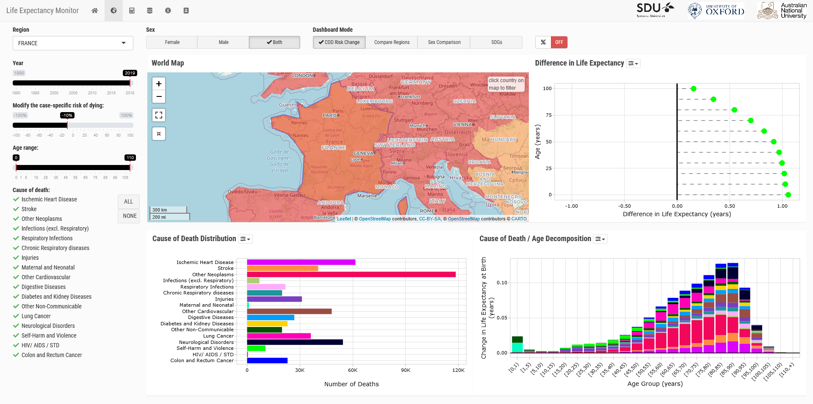

<!-- README.md is generated from README.Rmd. Please edit that file -->

```{r, include = FALSE}
knitr::opts_chunk$set(
  collapse = TRUE,
  comment = "#>",
  fig.path = "man/figures/README-",
  out.width = "100%"
)
```

# {lemur} - Life expectancy monitor upscaled in R
### R package and Shiny application

<!-- badges: start -->
[](https://www.tidyverse.org/lifecycle/#experimental)
[](https://github.com/mpascariu/lemur/issues)
[](https://github.com/mpascariu/lemur/blob/master/LICENSE)

<!-- badges: end -->

The life expectancy monitoring tool allows the user to selected 
mortality changes over the entire lifespan or at specific ages, as well as 
for overall mortality or for specific causes of death. For example, how 
would life expectancy look if cardiovascular mortality were to be reduced 
by 50\%? Or how would life expectancy look if infant mortality was eliminated? 
The tool facilitates assessing changes and comparisons in life expectancy 
under those selected scenarios of mortality change. Furthermore, the tool 
lets the user compare cause-of-death profiles and life expectancies across 
time, countries and sexes.

## Installation

You can install the development version from 
[GitHub](https://github.com/mpascariu/lemur) with:

``` r
# install.packages("devtools")
devtools::install_github("mpascariu/lemur")
```
## Example

This is a basic example which shows you how to launch the monitor in your
browser:

```r
lemur::run_app()
```
[](https://github.com/mpascariu/lemur)

All the simulations done in the monitor can be executed using the `R` syntax
directly in the R/Rstudio console. See the available data object 
`data_gbd2019_cod`, `data_gbd2019_lt` or the help pages of relevant functions 
like `decompose_by_cod()`, `modify_life_table()` and the related `plot` 
functions.

### Support us
We are researchers who enjoys making useful utilities. 
You're probably here as a result of our free software and apps.

The software solutions we create have the purpose of supporting teachers, 
students and anyone else interested in life expectancy modeling and demographic 
research. All of this is developed in our limited, spare time, 
and your contribution helps to remind us how important our work is.

donate (ETH / ERC20): `0x58CfD867256e0a93F98873C0B9C45a4fEfF974e4`
