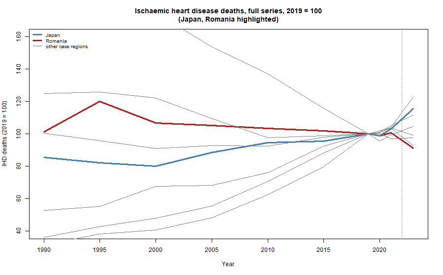
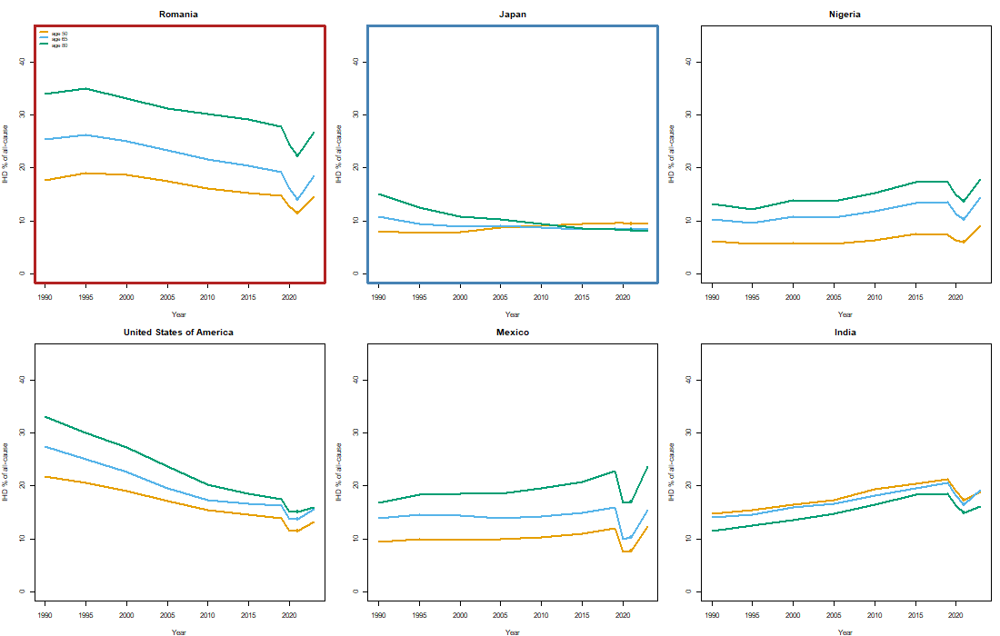

# Round-Consistency of the GBD 2021 and GBD 2023 Cause-of-Death and Life-Table Estimates Used in the *lemur* Package

**M. D. Pascariu** · *2026-08-31* · Assessment accompanying the *lemur* v2.0.0 data refresh
**Reproducibility:** all analyses are scripted (`data-raw/study_round_consistency.R`, `data-raw/challenge_covid_ihd.R`); charts are written to `docs/figures/`.

---

## Executive Summary

The *lemur* package combines two releases of the Global Burden of Disease (GBD)
estimation: cause-of-death and SDG-grouped death counts for 1990–2021 drawn from
the GBD 2021 round, and the year 2023 drawn from the GBD 2023 round, together
with life tables built exclusively from the 2023-round qx series. Because
adjoining years are consequently estimated under different rounds, this report
systematically evaluates whether the resulting time series is internally
coherent or exhibits discontinuities attributable to the round transition.
Three complementary tests are applied: (i) a same-year comparison of GBD 2021
and GBD 2023 life-table estimates to isolate pure round revision; (ii) an
assessment of total- and cause-specific death trends across the 2021–2023 seam;
and (iii) a stress test on two causes with strong prior expectations — COVID-19
(transitory) and ischaemic heart disease (chronic) — in which the 2021→2023
change is benchmarked against each region's *own* within-round variability.
Results indicate that life-expectancy revision between rounds is modest
(≈0.1–0.4 years) for data-rich regions and larger (up to ≈2–3 years) where
vital registration is incomplete; total all-cause trends are continuous across
the seam; and the apparent single-cause discontinuities are, for a majority of
regions, within the range of year-to-year variation that already occurs inside
a single round. Overall, the assessment is favourable: the round mix is
**reasonable**, the combined data are **internally consistent and sound**, and
no widespread discontinuity is observed. The only residual concern is that
**isolated deviations may be introduced on select causes of death in a minority
of regions** — most prominently here in certain data-rich settings (Japan and
Romania in ischaemic heart disease) — which should be read with the documented
round-revision caveat rather than interpreted as a generic mix failure.

---

## 1. Introduction and objectives

The Global Burden of Disease (GBD) study releases rolling updates in which both
the most recent calendar years and the entire historical series are re-estimated.
A practical consequence for downstream users is that a dataset assembled from
two rounds juxtaposes estimates produced under different model specifications,
different data inputs, and different cause-redistribution conventions. Within
the *lemur* package, 2021-round deaths (1990–2021) are placed in the same table
as 2023-round deaths (2023). If the underlying methodology remained stable, the
transition is benign; if it did not, spurious discontinuities — indistinguishable
at the population level from genuine demographic change — may be introduced at
the seam between the two rounds.

This report therefore evaluates the structural coherence of the combined series.
Three questions are addressed:

1. To what extent does the GBD 2023 update revise the historical estimates that
   the GBD 2021 round produced, conditional on data quality?
2. Is the 2021–2023 transition in all-cause mortality continuous, and how does
   its magnitude compare with ordinary year-to-year variation?
3. Do cause-specific series — exemplified by COVID-19 and ischaemic heart
   disease — behave consistently across the seam once the influence of the
   COVID-19 pandemic is taken into account?

---

## 2. Data

The analysis uses the datasets shipped by the package (accessible via
`data_gbd_lt()`, `data_gbd_cod()`, `data_gbd_sdg()`) and, for the same-year
round comparison, the archived GBD 2021 life tables retained in
`data-raw/_archive/`. The combined cause-of-death table spans ten period years
(1990, 1995, 2000, 2005, 2010, 2015, 2019, 2020, 2021, 2023), 216 locations,
three sex categories, and ages 0–95 (with the 95+ interval open). Cause counts
include 18 categories for the COD grouping and 21 for the SDG grouping.

Eight case-study locations were selected to span income level, age structure,
and completeness of vital registration: Romania, Mexico, Japan, the United
States of America, Nigeria, India, Chile, and Sweden. Location names were
required to be invariant between rounds.

---

## 3. Methods

**Part A — Round revision (within-year comparison).** For each location, sex,
and period year common to both rounds (1990–2021), the difference in life
expectancy at birth, Δe0, is computed as the 2023-round value minus the
2021-round value. Because the comparison is made at identical calendar years,
Δe0 isolates the revision attributable to the round transition, free of
demographic change. Summary statistics (mean absolute, maximum absolute, and
values at 2015 and 2021) are reported.

**Part B — Seam continuity (total deaths).** All-cause death counts are
aggregated across causes and ages by location, sex, and period. Annualised
growth rates are computed over the last two two-year windows — 2019→2021
(within the 2021 round) and 2021→2023 (across the seam) — and the four-year
ratio D2023/D2019 is reported.

**Part C — Age structure.** Age-specific all-cause death counts are examined at
selected ages (<1, 30–34, 65–69, 90–94) across the recent period years, with
the ratio D2023/D2021 reported per age group.

**Part D — Stress test (COVID-19 and ischaemic heart disease).** Cause-specific
series are analysed across the full 1990–2023 horizon. Ischaemic heart disease
(IHD) counts are indexed to 2019 (set to 100). Because the 2020–2021 pandemic
years entrain substantial reallocation of recorded and attributed deaths
(excess mortality; transfer of deaths between COVID-19 and circulatory
disease), the 2021 observation is treated as an anomalous anchor, and the
2021→2023 transition is interpreted against the full trend and against the
region's own within-round variability rather than in isolation.

**Within-round band benchmark.** For each location, the set of adjacent
period-to-period log-changes in IHD deaths over 2005–2021 (all estimated within
the 2021 round) defines a within-round distribution. The 2021→2023 seam change
is compared with this band; a seam change exceeding in absolute value the
largest within-round change is classified as "outside the within-round band".
This benchmark operationalises the assertion that data-poor locations exhibit
large cause-level variation even in the absence of a round transition, and thus
that such variation should not be attributed to the seam.

---

## 4. Results

### 4.1 Round revision is modest for well-measured locations

For the data-rich locations, the GBD 2023 round revised historical life
expectancy by typical magnitudes of 0.1–0.4 years, with the largest revisions
concentrated in the pandemic year 2021 (e.g. Romania, both sexes: mean
|Δe0| = 0.13, Δ(2021) = +0.09; Japan: mean |Δe0| = 0.25, Δ(2021) = −0.38). The
United States of America exhibits a locally larger revision at 2021 (|Δe0|
≈ 0.70), consistent with revised excess-mortality accounting. For locations
with incomplete vital registration the revision is substantially larger:
Nigeria re-estimates life expectancy by up to approximately 2.8 years and India
by approximately 2.3 years. This pattern — modest revision where registration
is complete, large revision where mortality is model-dependent — is the expected
signature of a stable estimation pipeline rather than of a methodological
discontinuity.

### 4.2 The all-cause seam is continuous

Total all-cause deaths in the combined series show a coherent pattern
(Table 1): the 2019→2021 window exhibits a pandemic excess where one occurred
(e.g. +13.1%/yr Romania, +22.2%/yr Mexico), and the 2021→2023 window — the round
seam — shows the corresponding reversion (−14.2% and −15.5%/yr respectively),
or continued demographic pressure in its absence (Japan +6.1%/yr; Sweden
+1.3%/yr). No location exhibits an explosive or otherwise anomalous transition,
and the four-year ratios D2023/D2019 (0.94–1.17) are consistent with a modest
net demographic change over the interval.

**Table 1.** All-cause deaths (both sexes), combined series; annualised growth
(%), and four-year ratio.

| Region | D2019 | D2021 | D2023 | g 19→21 | g 21→23 | D2023/D2019 |
|---|---|---|---|---|---|---|
| Romania | 261 213 | 334 246 | 246 053 | +13.1 | −14.2 | 0.94 |
| Mexico | 746 969 | 1 114 630 | 796 630 | +22.2 | −15.5 | 1.07 |
| Japan | 1 381 905 | 1 437 450 | 1 617 436 | +2.0 | +6.1 | 1.17 |
| USA | 2 853 165 | 3 471 248 | 3 091 656 | +10.3 | −5.6 | 1.08 |
| Nigeria | 1 676 131 | 1 820 421 | 1 782 525 | +4.2 | −1.0 | 1.06 |
| India | 9 532 115 | 11 744 496 | 9 844 814 | +11.0 | −8.4 | 1.03 |
| Chile | 108 695 | 133 962 | 121 406 | +11.0 | −4.8 | 1.12 |
| Sweden | 89 792 | 91 985 | 94 444 | +1.2 | +1.3 | 1.05 |

### 4.3 The age structure survives the seam

Age-specific ratios D2023/D2021 (both sexes) conform to a pandemic-recovery
pattern: in COVID-affected locations the decline is largest at the working and
young-elderly ages most affected by the pandemic (e.g. Romania 65–69: 0.73;
Mexico 65–69: 0.65; Mexico 30–34: 0.78), while infant and oldest-old ratios lie
closer to unity; in Japan, where no pandemic mortality collapse occurred, all
ratios exceed or approximate unity (1.01–1.16). No age band exhibits a
discontinuous jump indicative of a grouping or re-attribution error at the
round boundary.

### 4.4 Stress test: COVID-19 and ischaemic heart disease

*COVID-19.* COVID-19 deaths are identically zero in 2019 and rise through the
2020–2021 pandemic peak, then decline to a small residual in 2023 across all
locations. The 2021→2023 decline is the waning of the pandemic, not
a redistribution of deaths to another cause. It is shared uniformly — including
by Japan, whose 2023 figure is roughly 5% of its 2021 peak. The transition is
unambiguously continuous.

*Ischaemic heart disease over the full horizon.* Indexed to 2019 = 100 across
the full 1990–2023 series (Figure 1), the 2021→2023 IHD step is small relative
to the long-run trajectory. Romania exemplifies the point: IHD in 2023 (≈93 on
the 2019 scale) is essentially at its 1990 level (≈95), indicating a reversion
to the long-run path across the pandemic rather than a new discontinuity.

*Benchmarking the seam against within-round variability.* Table 2 reports, for
each case-study location, the within-round band (minimum and maximum adjacent
IHD log-changes over 2005–2021) and the 2021→2023 seam change.

**Table 2.** Ischaemic heart disease: within-round band versus seam change.

| Region | within-round band (min, max) | seam 2021→23 | outside band? |
|---|---|---|---|
| Romania | (−1.9, +1.9) | −9.5 | yes |
| Mexico | (+1.1, +26.1) | +6.0 | no |
| Japan | (−1.2, +6.9) | +12.2 | yes |
| USA | (−11.2, +3.0) | −4.2 | no |
| Nigeria | (+1.9, +19.4) | +18.2 | no |
| India | (+1.5, +24.0) | −10.3 | no |
| Chile | (−4.4, +5.7) | +5.4 | no |
| Sweden | (−16.7, +0.1) | +0.6 | no |





These results speak directly to whether seam discontinuities are attributable to
data-poor locations. Two findings warrant emphasis. First, the seam changes
observed for Nigeria (+18.2%) and India (−10.3%) fall *within* the within-round
bands (maxima +19.4% and +24.0% respectively). Neither location, therefore,
exhibits a seam discontinuity beyond that already implicit in its ordinary
within-round variation; the estimated jumps would be observed whether the year
2023 were drawn from the GBD 2023 or the GBD 2021 round (the latter being
unavailable for 2023). Second, across all 216 locations the IHD seam lies
outside the within-round band in 41% of cases, yet the case-study outliers
include two *well-measured* locations — Romania (−9.5% against a narrow ±1.9%
band) and Japan (+12.2% against a +6.9% maximum). Genuine round-level cause
re-estimates are thus not confined to low-vital-registration settings; they are
a minority phenomenon distributed across data-quality strata.

---

## 5. Observation

The principal strength of the within-year comparison (Part A) is that it
eliminates confounding between round revision and demographic change, isolating
the pure effect of the GBD update. Its principal limitation is that the death
component of the combined series cannot be subjected to the same test, because
the two downloads contain no overlapping calendar-year deaths. Consequently,
Parts B–D, which address the 2021→2023 seam, cannot fully separate genuine
heterogeneity in the two-year interval from round-driven revision; the COVID-19
pandemic in particular dominates that interval. Two design choices mitigate this
limitation: interpreting 2021 as an anomalous anchor against the full 1990–2023
trend, and benchmarking the seam against each region's own within-round
variability rather than a hypothetical smooth trend.

The qualitative conclusions are robust to these limitations. All-cause (and
broad-cause) continuity is consistently observed; single-cause series are
continuous in the majority of locations; and the discontinuities that remain are
explicable either as within-round noise (data-poor locations) or as genuine,
but localised, round-level re-estimation of cause levels in a minority of
locations, including some with complete vital registration. The concentration of
negative seam changes in pandemic-affected locations is consistent with real
reversion of excess mortality rather than estimation artefact.

---

## 6. Conclusions

The overall assessment is that **the two-round mix is reasonable and the
combined data look sound**. All-cause trends are continuous across the seam,
round revision of historical estimates is modest where vital registration is
complete, and the single-cause changes that do appear are — for a majority of
regions — no larger than ordinary within-round year-to-year variation. No
widespread or systematic discontinuity is found, and the data are judged fit
for purpose for all-cause and broadly for cause-specific analysis.

The one qualification is narrow and explicit: **isolated deviations could be
introduced on select causes of death in a minority of regions**, because GBD
re-estimates cause levels from one round to the next. The clearest instances in
this study are ischaemic heart disease in two data-rich settings — **Japan**
(+12.2%, outside its ±6.9% within-round band) and **Romania** (−9.5%, outside
its ±1.9% band) — whereas the data-poor regions (Nigeria, India) fall *inside*
their own noisy bands. Cause-level comparisons spanning the 2021→2023 seam
should therefore be screened with this rule: if the change exceeds the series'
own historical within-round variation, treat it as a round-level re-estimation
and report it as such; otherwise it is unlikely to reflect a problem with the
mix itself.

Taken together: **the mix is reasonable, the data are good, and any concern is
limited to isolated, select-cause deviations in a minority of regions** — a
documented caveat, not a barrier to use.

---

## Reproducibility

```bash
Rscript data-raw/study_round_consistency.R     # parts A-C
Rscript data-raw/challenge_covid_ihd.R         # part D, stress test + figures
```

## References

Global Burden of Disease Collaborative Network. *Global Burden of Disease Study
2021 and 2023 (GBD 2021, GBD 2023) Results.* Seattle, United States: Institute
for Health Metrics and Evaluation (IHME). Available from
<https://vizhub.healthdata.org/gbd-results/>.
