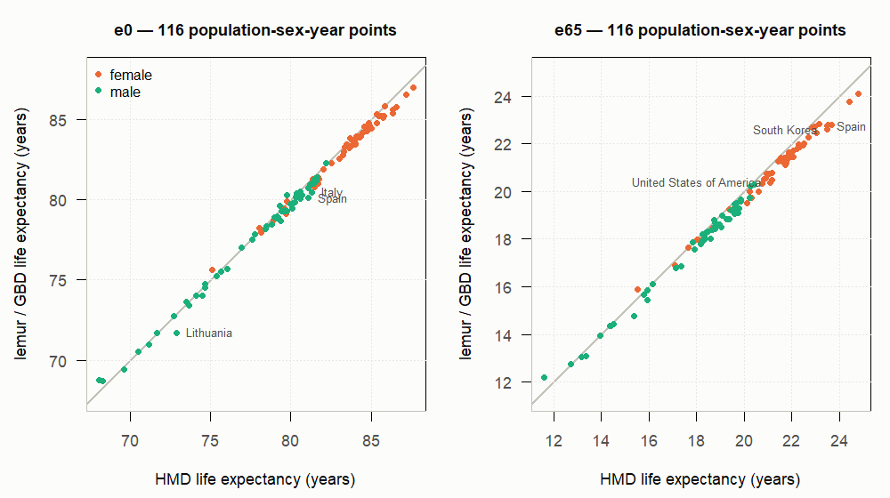

# External Validation of the *lemur* Life Tables against the Human Mortality Database

**M. D. Pascariu** · *2026-09-02* · Companion to the round-consistency study (*lemur* v2.0.0 data refresh)
**Reproducibility:** `Rscript data-raw/validate_hmd_ex.R`; figure written to `docs/figures/hmd_validation.png`.

---

## 1. Objective

The package's life tables are built from GBD 2023-round qx series. This check validates them against an independent gold standard: the Human Mortality Database (HMD), whose tables are built from raw vital-registration data with complete-coverage requirements. We compare life expectancy at birth (e0) and at age 65 (e65) across all HMD countries, 2021 and 2023.

```
  GBD 2023-round qx  ──▶  lemur life tables (e0, e65)  ──┐
                                                          ├──  diff = GBD − HMD
  HMD summary workbook (e0, e65)  ──────────────────────-─┘
        40 national populations · both/female/male · 2021 & 2023
```

---

## 2. Data

**lemur:** `inst/extdata/lt_dt.rds` via `data_gbd_lt()` — abridged tables, ages 0–95, `ex` read directly at ages 0 and 65.

**HMD:** `data-raw/IHME_GBD2023_Data/hmd_summary_ex_0_65_80.xlsx` — HMD summary indicators (last modified 27 Aug 2026), one sheet per sex × age (e0, e65, e80; e80 not used here), years as rows, 50 populations as columns.

**Matching:** 34 populations match GBD region names directly; six are mapped to their national GBD counterpart (France, Germany, New Zealand "Total population" series; Republic of Korea → South Korea; U.K. total; U.S.A.). Ten sub-population series are dropped (Maori, East/West Germany, England & Wales, Scotland, Northern Ireland, civilian France) as not comparable to national GBD estimates, as is Hong Kong, which is absent from GBD's 216 locations. **40 national populations** are compared.

**Coverage:** the workbook does not cover every country-year — 32/40 countries have 2021 values and 26/40 have 2023 values, giving **174 comparisons per age** (population × sex × year).

---

## 3. Results

Differences are GBD (lemur) minus HMD, in years of life expectancy.

**Table 1.** Summary of differences by age, sex, and period.

| age | sex | period | n | mean | mean \|diff\| | min | max |
|---|---|---|---|---|---|---|---|
| 0 | both | 2021 | 32 | −0.20 | 0.30 | −0.60 | +0.64 |
| 0 | both | 2023 | 26 | −0.34 | 0.35 | −0.99 | +0.03 |
| 0 | female | 2021 | 32 | −0.28 | 0.34 | −0.78 | +0.53 |
| 0 | female | 2023 | 26 | −0.37 | 0.37 | −0.92 | −0.03 |
| 0 | male | 2021 | 32 | −0.12 | 0.27 | −0.52 | +0.68 |
| 0 | male | 2023 | 26 | −0.30 | 0.33 | −1.17 | +0.08 |
| 65 | both | 2021 | 32 | −0.28 | 0.32 | −0.71 | +0.49 |
| 65 | both | 2023 | 26 | −0.37 | 0.37 | −0.69 | −0.04 |
| 65 | female | 2021 | 32 | −0.35 | 0.38 | −0.84 | +0.36 |
| 65 | female | 2023 | 26 | −0.43 | 0.43 | −0.89 | −0.12 |
| 65 | male | 2021 | 32 | −0.22 | 0.26 | −0.53 | +0.61 |
| 65 | male | 2023 | 26 | −0.29 | 0.29 | −0.65 | +0.03 |

**Table 2.** Share of comparisons within agreement bands.

| age | n | ±0.25 yr | ±0.5 yr | ±1.0 yr | ±2.0 yr |
|---|---|---|---|---|---|
| e0 | 174 | 43% | 82% | 99.4% | 100% |
| e65 | 174 | 36% | 79% | 100% | 100% |

The largest deviation in the entire comparison is Lithuania, male e0, 2023: **−1.17 yr** (GBD 71.70 vs HMD 72.87). The next largest are Spain male e0 2023 (−0.98) and South Korea female e65 (−0.84 to −0.89). Nothing approaches the 2–3 yr revisions seen in data-poor GBD regions.

**Tables 3–6** give the full per-country detail — e0 and e65, each split by period — with male and female side by side, one row per country. For each sex the columns show the HMD value, the lemur (GBD) value, and the difference (lemur − HMD); an em dash means the workbook carries no HMD value for that country-year — eight countries (Belarus, Germany, Greece, Hungary, Israel, Russia, Slovenia, Ukraine) have no values at all in the export, and several others lack one of the two years.

**Table 3.** e0, 2021 (years of life expectancy).

| Country | HMD (F) | lemur (F) | Diff (F) | HMD (M) | lemur (M) | Diff (M) |
|---|---|---|---|---|---|---|
| Australia | 85.45 | 85.21 | -0.24 | 81.50 | 81.36 | -0.14 |
| Austria | 83.74 | 83.33 | -0.41 | 78.79 | 78.47 | -0.32 |
| Belarus | — | 78.27 | — | — | 68.76 | — |
| Belgium | 84.00 | 83.51 | -0.49 | 79.21 | 78.89 | -0.32 |
| Bulgaria | 75.10 | 75.63 | +0.53 | 68.05 | 68.73 | +0.68 |
| Canada | 83.96 | 83.57 | -0.39 | 79.14 | 78.85 | -0.29 |
| Chile | 81.76 | 81.27 | -0.49 | 75.63 | 75.54 | -0.09 |
| Croatia | 79.74 | 79.89 | +0.15 | 73.48 | 73.63 | +0.15 |
| Czechia | 80.51 | 80.37 | -0.14 | 74.11 | 74.03 | -0.08 |
| Denmark | 83.30 | 82.99 | -0.31 | 79.57 | 79.27 | -0.30 |
| Estonia | 81.35 | 81.27 | -0.08 | 72.72 | 72.77 | +0.05 |
| Finland | 84.48 | 84.16 | -0.32 | 79.15 | 78.96 | -0.19 |
| France | 85.34 | 85.30 | -0.04 | 79.30 | 79.60 | +0.30 |
| Germany | — | 82.75 | — | — | 77.94 | — |
| Greece | — | 82.54 | — | — | 77.38 | — |
| Hungary | — | 77.53 | — | — | 70.60 | — |
| Iceland | 84.36 | 83.93 | -0.43 | 81.44 | 81.15 | -0.29 |
| Ireland | 83.68 | 83.81 | +0.13 | 79.74 | 80.30 | +0.56 |
| Israel | — | 84.31 | — | — | 80.47 | — |
| Italy | 84.72 | 84.26 | -0.46 | 80.27 | 79.84 | -0.43 |
| Japan | 87.61 | 86.97 | -0.64 | 81.48 | 81.29 | -0.19 |
| Latvia | 78.05 | 78.22 | +0.17 | 68.26 | 68.72 | +0.46 |
| Lithuania | 78.91 | 78.72 | -0.19 | 69.62 | 69.43 | -0.19 |
| Luxembourg | 84.60 | 84.56 | -0.04 | 80.36 | 80.40 | +0.04 |
| Netherlands | 83.00 | 82.58 | -0.42 | 79.69 | 79.31 | -0.38 |
| New Zealand | 84.02 | 83.45 | -0.57 | 80.56 | 80.04 | -0.52 |
| Norway | 84.73 | 84.33 | -0.40 | 81.59 | 81.17 | -0.42 |
| Poland | 79.60 | 79.46 | -0.14 | 71.64 | 71.69 | +0.05 |
| Portugal | 84.27 | 83.87 | -0.40 | 78.42 | 78.18 | -0.24 |
| Russia | — | 74.69 | — | — | 66.14 | — |
| Slovakia | 78.16 | 77.97 | -0.19 | 71.16 | 71.00 | -0.16 |
| Slovenia | — | 83.31 | — | — | 77.37 | — |
| South Korea | 86.57 | 85.79 | -0.78 | 80.67 | 80.27 | -0.40 |
| Spain | 85.79 | 85.24 | -0.55 | 80.15 | 79.79 | -0.36 |
| Sweden | 84.82 | 84.41 | -0.41 | 81.22 | 80.95 | -0.27 |
| Switzerland | 85.61 | 85.21 | -0.40 | 81.62 | 81.40 | -0.22 |
| Taiwan | 83.88 | 83.65 | -0.23 | 77.60 | 77.49 | -0.11 |
| Ukraine | — | 74.93 | — | — | 66.12 | — |
| United Kingdom | 82.53 | 82.29 | -0.24 | 78.47 | 78.35 | -0.12 |
| United States of America | 79.68 | 79.10 | -0.58 | 73.67 | 73.42 | -0.25 |


**Table 4.** e0, 2023 (years of life expectancy).

| Country | HMD (F) | lemur (F) | Diff (F) | HMD (M) | lemur (M) | Diff (M) |
|---|---|---|---|---|---|---|
| Australia | — | 85.37 | — | — | 81.55 | — |
| Austria | 84.22 | 83.93 | -0.29 | 79.44 | 79.31 | -0.13 |
| Belarus | — | 78.94 | — | — | 69.35 | — |
| Belgium | 84.06 | 83.86 | -0.20 | 79.97 | 79.74 | -0.23 |
| Bulgaria | — | 79.27 | — | — | 72.30 | — |
| Canada | 83.94 | 83.67 | -0.27 | 79.56 | 79.35 | -0.21 |
| Chile | 83.25 | 82.75 | -0.50 | 77.78 | 77.82 | +0.04 |
| Croatia | 81.67 | 81.41 | -0.26 | 75.40 | 75.26 | -0.14 |
| Czechia | — | 82.48 | — | — | 76.73 | — |
| Denmark | 83.62 | 83.25 | -0.37 | 79.73 | 79.30 | -0.43 |
| Estonia | 83.05 | 82.58 | -0.47 | 74.48 | 74.02 | -0.46 |
| Finland | 84.20 | 83.92 | -0.28 | 78.97 | 78.92 | -0.05 |
| France | 85.73 | 85.11 | -0.62 | 80.11 | 79.46 | -0.65 |
| Germany | — | 82.97 | — | — | 78.22 | — |
| Greece | — | 83.44 | — | — | 78.08 | — |
| Hungary | — | 79.77 | — | — | 73.21 | — |
| Iceland | 84.06 | 83.92 | -0.14 | 80.60 | 80.53 | -0.07 |
| Ireland | — | 83.89 | — | — | 80.51 | — |
| Israel | — | 84.82 | — | — | 80.72 | — |
| Italy | 85.37 | 84.77 | -0.60 | 81.29 | 80.48 | -0.81 |
| Japan | 87.18 | 86.55 | -0.63 | 81.10 | 80.74 | -0.36 |
| Latvia | 80.51 | 80.36 | -0.15 | 70.49 | 70.55 | +0.06 |
| Lithuania | 81.72 | 80.98 | -0.74 | 72.87 | 71.70 | -1.17 |
| Luxembourg | 84.85 | 84.78 | -0.07 | 81.41 | 80.98 | -0.43 |
| Netherlands | 83.35 | 83.26 | -0.09 | 80.31 | 80.18 | -0.13 |
| New Zealand | — | 82.99 | — | — | 79.61 | — |
| Norway | 84.64 | 84.29 | -0.35 | 81.39 | 81.11 | -0.28 |
| Poland | 82.04 | 81.89 | -0.15 | 74.68 | 74.75 | +0.07 |
| Portugal | 85.02 | 84.46 | -0.56 | 79.35 | 78.69 | -0.66 |
| Russia | — | 78.52 | — | — | 67.46 | — |
| Slovakia | 81.30 | 81.08 | -0.22 | 74.67 | 74.55 | -0.12 |
| Slovenia | — | 83.99 | — | — | 78.70 | — |
| South Korea | 86.37 | 85.60 | -0.77 | 80.63 | 80.33 | -0.30 |
| Spain | 86.33 | 85.41 | -0.92 | 81.07 | 80.09 | -0.98 |
| Sweden | 84.91 | 84.62 | -0.29 | 81.59 | 81.36 | -0.23 |
| Switzerland | 85.83 | 85.80 | -0.03 | 82.21 | 82.29 | +0.08 |
| Taiwan | 83.46 | 83.42 | -0.04 | 76.92 | 77.00 | +0.08 |
| Ukraine | — | 78.19 | — | — | 66.41 | — |
| United Kingdom | — | 82.55 | — | — | 78.76 | — |
| United States of America | 81.48 | 80.78 | -0.70 | 76.05 | 75.68 | -0.37 |


**Table 5.** e65, 2021 (years of life expectancy).

| Country | HMD (F) | lemur (F) | Diff (F) | HMD (M) | lemur (M) | Diff (M) |
|---|---|---|---|---|---|---|
| Australia | 22.97 | 22.71 | -0.26 | 20.42 | 20.28 | -0.14 |
| Austria | 21.17 | 20.77 | -0.40 | 17.92 | 17.58 | -0.34 |
| Belarus | — | 17.58 | — | — | 12.75 | — |
| Belgium | 21.75 | 21.21 | -0.54 | 18.33 | 17.98 | -0.35 |
| Bulgaria | 15.52 | 15.88 | +0.36 | 11.60 | 12.21 | +0.61 |
| Canada | 22.32 | 21.87 | -0.45 | 19.43 | 19.21 | -0.22 |
| Chile | 20.60 | 19.99 | -0.61 | 17.13 | 16.79 | -0.34 |
| Croatia | 18.02 | 17.98 | -0.04 | 14.36 | 14.36 | +0.00 |
| Czechia | 18.65 | 18.46 | -0.19 | 14.53 | 14.43 | -0.10 |
| Denmark | 20.91 | 20.57 | -0.34 | 18.20 | 17.92 | -0.28 |
| Estonia | 19.59 | 19.47 | -0.12 | 14.53 | 14.43 | -0.10 |
| Finland | 21.95 | 21.61 | -0.34 | 18.46 | 18.32 | -0.14 |
| France | 23.14 | 22.83 | -0.31 | 19.08 | 18.99 | -0.09 |
| Germany | — | 20.48 | — | — | 17.34 | — |
| Greece | — | 20.21 | — | — | 17.36 | — |
| Hungary | — | 16.98 | — | — | 12.96 | — |
| Iceland | 21.75 | 21.35 | -0.40 | 20.24 | 19.75 | -0.49 |
| Ireland | 21.41 | 21.27 | -0.14 | 18.74 | 18.79 | +0.05 |
| Israel | — | 21.44 | — | — | 19.10 | — |
| Italy | 21.96 | 21.51 | -0.45 | 18.78 | 18.42 | -0.36 |
| Japan | 24.78 | 24.09 | -0.69 | 19.87 | 19.64 | -0.23 |
| Latvia | 17.64 | 17.64 | +0.00 | 12.73 | 12.74 | +0.01 |
| Lithuania | 18.16 | 17.94 | -0.22 | 13.36 | 13.07 | -0.29 |
| Luxembourg | 21.97 | 21.57 | -0.40 | 18.79 | 18.69 | -0.10 |
| Netherlands | 20.76 | 20.33 | -0.43 | 18.18 | 17.80 | -0.38 |
| New Zealand | 22.05 | 21.45 | -0.60 | 19.80 | 19.27 | -0.53 |
| Norway | 21.86 | 21.44 | -0.42 | 19.70 | 19.25 | -0.45 |
| Poland | 18.31 | 18.11 | -0.20 | 13.96 | 13.93 | -0.03 |
| Portugal | 21.81 | 21.35 | -0.46 | 18.22 | 17.87 | -0.35 |
| Russia | — | 15.47 | — | — | 12.04 | — |
| Slovakia | 17.08 | 16.88 | -0.20 | 13.17 | 13.04 | -0.13 |
| Slovenia | — | 20.62 | — | — | 16.69 | — |
| South Korea | 23.65 | 22.81 | -0.84 | 19.37 | 18.85 | -0.52 |
| Spain | 23.03 | 22.46 | -0.57 | 18.90 | 18.56 | -0.34 |
| Sweden | 21.99 | 21.58 | -0.41 | 19.44 | 19.19 | -0.25 |
| Switzerland | 22.71 | 22.28 | -0.43 | 19.86 | 19.60 | -0.26 |
| Taiwan | 21.89 | 21.62 | -0.27 | 18.36 | 18.25 | -0.11 |
| Ukraine | — | 15.38 | — | — | 11.61 | — |
| United Kingdom | 20.83 | 20.50 | -0.33 | 18.32 | 18.08 | -0.24 |
| United States of America | 20.12 | 19.50 | -0.62 | 17.34 | 16.86 | -0.48 |


**Table 6.** e65, 2023 (years of life expectancy).

| Country | HMD (F) | lemur (F) | Diff (F) | HMD (M) | lemur (M) | Diff (M) |
|---|---|---|---|---|---|---|
| Australia | — | 22.84 | — | — | 20.39 | — |
| Austria | 21.56 | 21.27 | -0.29 | 18.39 | 18.27 | -0.12 |
| Belarus | — | 18.10 | — | — | 13.30 | — |
| Belgium | 21.80 | 21.44 | -0.36 | 18.95 | 18.62 | -0.33 |
| Bulgaria | — | 18.28 | — | — | 14.80 | — |
| Canada | 22.29 | 21.96 | -0.33 | 19.66 | 19.37 | -0.29 |
| Chile | 21.71 | 21.12 | -0.59 | 18.65 | 18.40 | -0.25 |
| Croatia | 19.50 | 19.22 | -0.28 | 15.94 | 15.86 | -0.08 |
| Czechia | — | 20.11 | — | — | 16.55 | — |
| Denmark | 21.07 | 20.72 | -0.35 | 18.33 | 18.00 | -0.33 |
| Estonia | 21.16 | 20.50 | -0.66 | 15.93 | 15.45 | -0.48 |
| Finland | 21.70 | 21.41 | -0.29 | 18.27 | 18.20 | -0.07 |
| France | 23.53 | 22.81 | -0.72 | 19.76 | 19.11 | -0.65 |
| Germany | — | 20.74 | — | — | 17.69 | — |
| Greece | — | 21.09 | — | — | 18.25 | — |
| Hungary | — | 18.43 | — | — | 14.63 | — |
| Iceland | 21.97 | 21.45 | -0.52 | 19.60 | 19.29 | -0.31 |
| Ireland | — | 21.28 | — | — | 18.90 | — |
| Israel | — | 22.03 | — | — | 19.76 | — |
| Italy | 22.50 | 22.01 | -0.49 | 19.58 | 19.16 | -0.42 |
| Japan | 24.42 | 23.76 | -0.66 | 19.54 | 19.17 | -0.37 |
| Latvia | 19.36 | 19.24 | -0.12 | 14.39 | 14.35 | -0.04 |
| Lithuania | 20.32 | 19.73 | -0.59 | 15.37 | 14.75 | -0.62 |
| Luxembourg | 22.21 | 21.78 | -0.43 | 19.61 | 19.46 | -0.15 |
| Netherlands | 20.93 | 20.76 | -0.17 | 18.77 | 18.53 | -0.24 |
| New Zealand | — | 21.15 | — | — | 19.03 | — |
| Norway | 21.91 | 21.52 | -0.39 | 19.69 | 19.35 | -0.34 |
| Poland | 20.23 | 20.00 | -0.23 | 16.17 | 16.12 | -0.05 |
| Portugal | 22.47 | 21.93 | -0.54 | 19.04 | 18.51 | -0.53 |
| Russia | — | 18.44 | — | — | 14.32 | — |
| Slovakia | 19.59 | 19.32 | -0.27 | 15.80 | 15.67 | -0.13 |
| Slovenia | — | 21.28 | — | — | 17.82 | — |
| South Korea | 23.49 | 22.60 | -0.89 | 19.28 | 18.85 | -0.43 |
| Spain | 23.49 | 22.74 | -0.75 | 19.60 | 19.06 | -0.54 |
| Sweden | 22.08 | 21.72 | -0.36 | 19.68 | 19.49 | -0.19 |
| Switzerland | 22.83 | 22.68 | -0.15 | 20.27 | 20.21 | -0.06 |
| Taiwan | 21.55 | 21.41 | -0.14 | 17.85 | 17.88 | +0.03 |
| Ukraine | — | 18.90 | — | — | 14.35 | — |
| United Kingdom | — | 20.69 | — | — | 18.36 | — |
| United States of America | 21.11 | 20.38 | -0.73 | 18.58 | 18.02 | -0.56 |



---

## 4. Interpretation

1. **Agreement is very good.** Essentially every comparison (99.4% at e0, 100% at e65) falls within one year, and four in five within half a year — well inside the spread one expects between two independent estimation systems.
2. **A small systematic direction exists:** GBD sits below HMD on average (−0.1 to −0.4 yr), and slightly more so in 2023 than 2021. This is the expected signature rather than a defect: HMD builds tables directly from complete vital registration, while GBD models, standardises, and redistributes causes, which pulls slightly downward in well-measured settings. The 2021→2023 widening is consistent with the modest 2023-round revision documented in the round-consistency study.
3. **No evidence of a round-mix problem.** For the countries HMD covers — all data-rich — the package's tables track HMD to within a fraction of a year at both ages and in both years.

**Conclusion: the lemur life tables are externally validated against HMD. The two-round mix introduces no detectable error at e0 or e65 for well-measured populations; the residual is a small, one-directional GBD-vs-HMD estimation offset of ≲0.4 yr.**

---

## Caveats

- HMD coverage is limited to data-rich countries; the comparison says nothing about the 176 GBD locations outside it (those are addressed indirectly by the round-consistency study).
- The HMD workbook is the summary-indicator export, not the full 5×1 life-table files; e0/e65 values are the official HMD summary figures for each population-year available at download time (27 Aug 2026).
- GBD and HMD differ in open-interval handling and terminal-age conventions; this affects e65 only marginally, and the observed e65 agreement confirms it is not material.

---

## References

Human Mortality Database. *HMD summary indicators: Life expectancy estimates at select ages.* Max Planck Institute for Demographic Research (Germany), University of California, Berkeley (USA), French Institute for Demographic Studies (France). Available from <https://www.mortality.org/> (downloaded 2026-09-02).

Global Burden of Disease Collaborative Network. *GBD 2023 Results.* Seattle, United States: IHME, 2024. <https://vizhub.healthdata.org/gbd-results/>.
